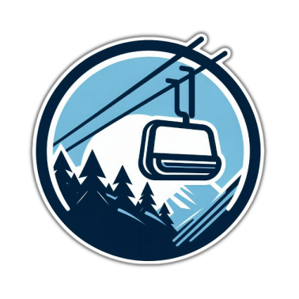

# SkiLift 🚡 🏔️

SkiLift is a lightweight library for implementing the **CQRS (Command Query Responsibility Segregation)** pattern in .NET applications. It provides abstractions and utilities to simplify the handling of commands, queries, and pipeline behaviors, enabling clean separation of concerns and extensibility. ❄️

## Features ❄️

- **🎯 Command and Query Handling**: Define commands and queries using marker interfaces and implement handlers for processing them.
- **🛷 Pipeline Behaviors**: Add middleware-like behaviors to requests for cross-cutting concerns such as logging, validation, or caching.
- **💉 Dependency Injection Integration**: Easily register handlers and pipeline behaviors with Microsoft.Extensions.DependencyInjection.
- **⛷️ Extensibility**: Customize the request dispatcher and add custom behaviors.

## Installation ⛄

To use SkiLift in your project, clone this repository and include the `SkiLift` project in your solution. Alternatively, you can package it as a NuGet package and reference it in your projects.

## Usage 🚡

### 1. Define Requests and Handlers 🎿

Define your commands and queries by implementing the `ICommand<TResponse>` or `IQuery<TResponse>` interfaces. These interfaces are **specialized aliases** for `IRequest<TResponse>` that provide improved semantic clarity for distinguishing between commands and queries. Similarly, `ICommandHandler<TCommand, TResponse>` and `IQueryHandler<TQuery, TResponse>` are **aliases** for `IRequestHandler<TRequest, TResponse>` that serve the same purpose of enhancing code readability and intent.

```csharp
public class CreateOrderCommand : ICommand<bool>
{
    public string OrderId { get; set; }
}

public class CreateOrderHandler : ICommandHandler<CreateOrderCommand, bool>
{
    public Task<bool> Handle(CreateOrderCommand request, CancellationToken cancellationToken)
    {
        // Handle the command logic here
        return Task.FromResult(true);
    }
}
```

### 2. Register Handlers and Pipeline Behaviors 🛷

Use the `AddSkiLift` extension method to configure SkiLift in your application's dependency injection container.

```csharp
using SkiLift.Configuration;

var services = new ServiceCollection();
services.AddSkiLift(config =>
{
    config.AddHandlersFromAssemblyContaining<CreateOrderHandler>();
    config.AddPipelineBehaviorsFromAssemblyContaining<LoggingBehavior>();
});
```

### 3. Dispatch Requests ❄️

Use the `IRequestDispatcher` to send commands or queries.

```csharp
var serviceProvider = services.BuildServiceProvider();
var dispatcher = serviceProvider.GetRequiredService<IRequestDispatcher>();

var result = await dispatcher.Send(new CreateOrderCommand { OrderId = "123" });
```

### 4. Add Pipeline Behaviors (Optional) ⛷️

Define custom pipeline behaviors by implementing the `IPipelineBehavior<TRequest, TResponse>` interface.

```csharp
public class LoggingBehavior<TRequest, TResponse> : IPipelineBehavior<TRequest, TResponse>
    where TRequest : IRequest<TResponse>
{
    public async Task<TResponse> Handle(
        TRequest request,
        RequestHandlerDelegate<TResponse> next,
        CancellationToken cancellationToken)
    {
        Console.WriteLine($"Handling {typeof(TRequest).Name}");
        var response = await next();
        Console.WriteLine($"Handled {typeof(TRequest).Name}");
        return response;
    }
}
```

### 5. Customizing the Dispatcher (Optional) 🚡

You can replace the default `RequestDispatcher` with a custom implementation by setting the `DispatcherType` property in the configuration.

```csharp
config.DispatcherType = typeof(CustomRequestDispatcher);
```

## Contributing 🤝

Contributions are welcome! Feel free to submit issues or pull requests to improve the library.

## Acknowledgements 🙏

SkiLift draws inspiration from [MediatR](https://github.com/jbogard/MediatR), a popular library for implementing the mediator pattern in .NET applications. However, SkiLift is not a fork or derivative of MediatR. Instead, it takes a more focused approach, prioritizing simplicity and extensibility to streamline the implementation of the CQRS pattern. While it does not aim to match the feature set of MediatR, SkiLift provides a lightweight and specialized solution for developers looking to adopt CQRS in their projects.

## License 📜

This project is licensed under the MIT License. See the [LICENSE](LICENSE) file for details.
